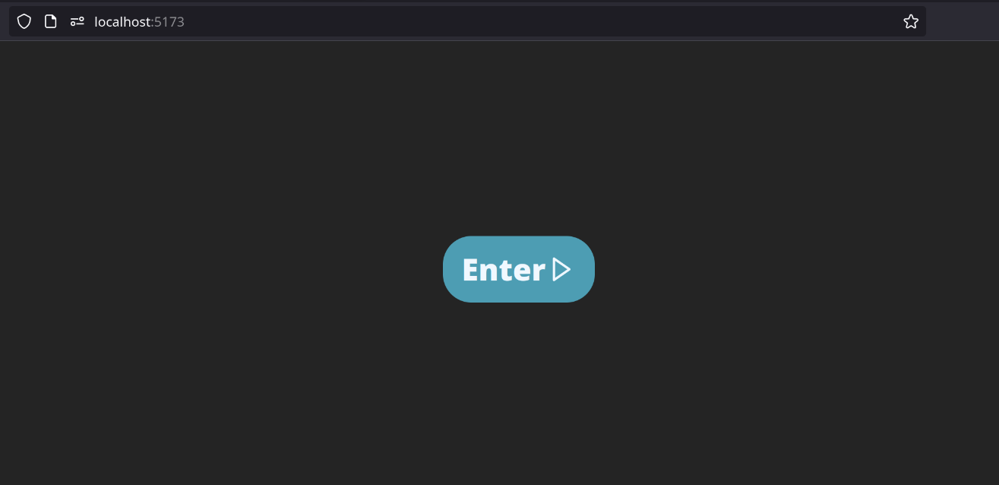

Source-Safe - Client Side
===

## How to run

First, confirm that you have Node and npm on your system:
```shell
node --version
```
```shell
npm --version
```

Then install the dependencies:
```shell
npm i
```
Now you're ready to run:

```shell
npm run dev
```

You will see the following screen on `http://localhost:5173/` :



This is the greeting screen of the application, it will be modified later.

### What should be done

- `/auth`
    - [X] `/register`
    - [X] `/authenticate`
    - [X] `/confirmemail`
    - [X] `/forgotpassword`

- `/user`
    - [X] `/change`
    - [X] `/update`
    - [X] `/search?query=&isMember=&groupId=`

- `/files`
    - [X] `/upload`
    - [X] `/update/{id}`
    - [X] `/accept/{id}`
    - [X] `/reject/{id}`
    - [X] `/download/{id}`
    - [X] `/downloadmany`
    - [X] `/groupfiles/{gid}?filter=` 
    - [X] `/groupfiles/{gid}?filter=in_use`
    - [X] `/groupfiles/{gid}?filter=in_use_by_me`
    - [X] ~~`/pending/{gid}`~~
    > - [ ] `/filechecks/{fid}`
    > - [ ] `/groupfilechecks/{gid}`
    > - [ ] `/userfilechecks`
    > - [ ] `/search?q=`

> quoted TODO items, are not done in backend yet

- [X] `/groups`
    - [X] `/create`
    - [ ] `/delete/{gid}`
    > - [ ] `/removemember`
    > - [ ] `/search?q=`

- `/invitations`
    - [X] `/invite`
    - [X] `/accept/{id}`
    - [X] `/reject/{id}`
    - [X] `/revoke/{id}`
    - [X] `/inbox`
    - [X] `/outbox`
    > - [ ] `/search?q=`

> - [ ] `/logs`
>   ...